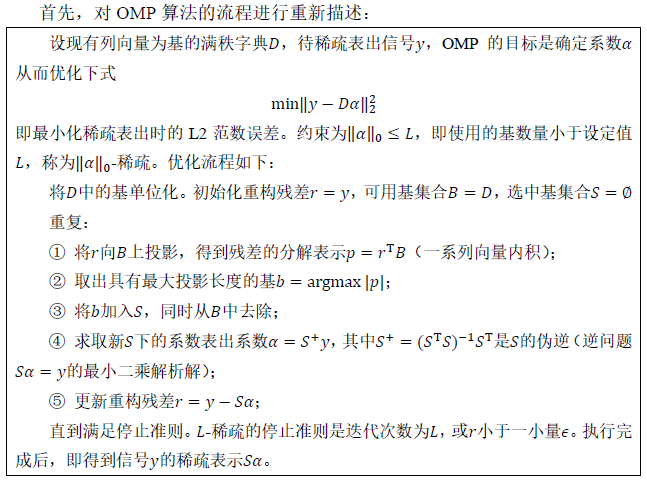

# ortho-matching-pursuit

A Python Implementation of Orthogonal Matching Pursuit (OMP) Algorithm

## OMP Algorithm

(From my course report: 信号与图像处理新进展课程报告)

## Results

See the `__main__` in [omp.py](./omp.py) .
